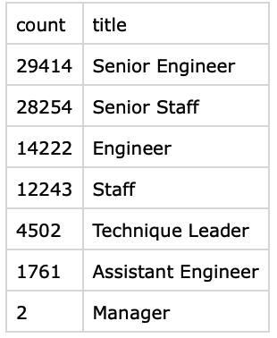

# Preparing for the "Silver Tsunami"

## Overview
The objective of this study was to understand how many Pewlett Hackard employees would be eligible for retirement in the near future.  This is vital information to prepare for the reduction in staff that will occur as this timeframe nears.  This is a massive amount of data that required the use of PostgreSQL to comb through the data to identify current employees nearing retirement, based on birth dates and employment dates.  This data was further broken out by title and department to understand impacts to different areas of the organization.  

## Results
The first step in the study was to understand the number of retiring employees by title. 

### Retirement Candidates by Title

This table points to a couple of areas of focus that should be considered in the approaching "silver tsunami".

* Senior employees (engineers and staff) appear to be retiring at a more rapid rate than other titles.  This indicates that the gap will be most felt at higher levels of the orgnization as these employees retire.
* While the number of Managers retiring is low, these are vital roles as leaders of their department.  This is critical to find an appropriate replacement to ensure the business runs smoothly as these most senior employees retire.  

### Mentorship Opportunities

One option to deal with the impending reduction in staff is to identify candidates who could serve as mentors to the next generation of up and coming employees.  The following query was built to identify candidates for this program.  

        -- Create mentorship elibility table
        SELECT DISTINCT ON (e.emp_no) e.emp_no,
	        e.first_name,
	        e.last_name,
	        e.birth_date,
	        de.from_date,
	        de.to_date,
	        t.title
        INTO mentorship_eligibility
        FROM employees as e
        LEFT JOIN dept_emp as de
        ON (e.emp_no = de.emp_no)
        LEFT JOIN titles as t
        ON (e.emp_no = t.emp_no)
        WHERE (de.to_date = '9999-01-01')
        AND (e.birth_date BETWEEN '1965-01-01' AND '1965-12-31')
        ORDER BY e.emp_no;

However, the numbers that were returned were cause for alarm

* Only 1,549 employees are eligible for this mentorship program, based on the selection criteria
* There were no managers that were identified as eligible for this program

## Summary

There are two key questions to answer in regards to the level of preparedness that Pewlett Hackard has in relation to its upcoming wave of retirees.  

1. How many roles will need to be filled as the "silver tsunami" begins to make an impact?

    Across all titles, there are 90,398 roles that will be opening up as these employees file for retirement.  

1. Are there enough qualified, retirement-ready employees in the departments to mentor the next generation of Pewlett Hackard employees?

    Not even close.  There are 1,549 mentorship candidates that were identified, which would barely exceed 1% of the employees that are retiring from Pewlett Hackard.  

There are a couple of additional queries that could be completed to invesigate how to solve for this issue even further.

* The list of possible mentorship candidates could be expanded beyond just those employees that were born in 1965.  However, even expanding this list of potential mentors would still pale in comparison to the number of employees retiring.
* In order to best support HR and the hiring spree they need to start ASAP, there could be additional queries to understand what departments are impacted the most, and by what level of staff (e.g. senior vs. junior level).  Resources should be prioritized for those departments with the highest number of employees leaving, especially for the senior roles that seem to be impacted the most.  